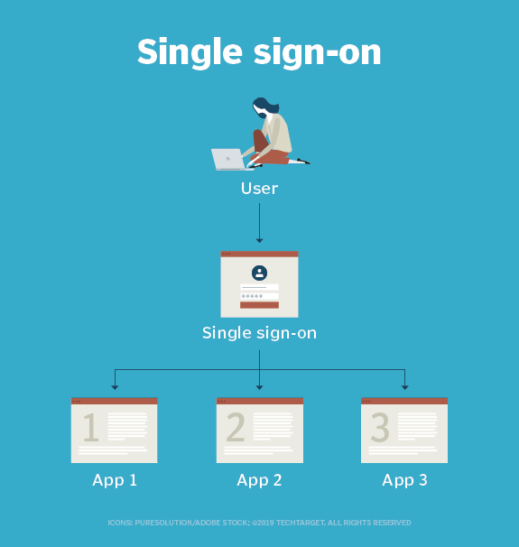

#### What is SSO ?

Single sign-on (SSO) is a technology that provide the user authentication service that permits a user to use one set of login credentials, for example, a username and password, to access all of their SaaS applications.
Single sign on would allow the enterprise system to securely store and own all of the user credentials. The platform then  establishes a trust relationship with the enterprise authentication server and client applications can be built to make the most of the trusted auth server to authenticate users.
 


#### What is SAML ?

Security Assertion Markup Language (SAML) is a protocol that enables SSO and follows a standardized way to verify the users’ credentials once and updates other applications about the user’s identity. 
 
The protocol involves a user, an identity provider and a service provider to authenticate and transfer data between the parties.
Let’s say you work for a company and they provided credentials to access the dashboard. The dashboard includes various external services. When you click on any external service, you automatically sign in to another web application without filling in any credentials. All this happened because of the SAML. The protocol uses XML based authentication to transfer a user’s identity between the IdP and SP. IdP, also known as Identity Provider, is responsible for authenticating and sharing identity data to SP.
SP (ex : demo.lms.fr), also known as Service Provider, receives the validated information from the IdP (ex :  PingOne server) and authorizes the user to access the external service or resources. Overall, with the help of SAML, any user with a valid account can access resources from multiple applications.


#### What is EuroPharma LMS ?

Europharma learning management system (LMS) is a web-based application that delivers online courses to your employees. It uses PHP 7 language, Symfony 4 Framework and MySql 8 database and runs on Ubuntu 20.04 server.


#### How is EuroPharmaLMS SSO configured ?

We are using the LightSAML Core PHP library, LightSAML Core is a PHP library implementing OASIS SAML 2.0 protocol, fully OOP structured with DPI principles, reusable, and embeddable.
 
SAML signing and encryption uses certificates (ex : `saml.crt`), to verify data sent between the Service Provider (SP, demo.lms.fr) and  PingOne Identity Provider (IdP,  PingOne). SAML certificates are distinct from SSL (TSL) certificates, which apply to the application's browser and are configured and maintained by the server.
The IdP ( PingOne Identity) server generates a metadata file (saml-idp.xml) that contains configuration and integration details for SAML 2.0 single sign-on. This file is used by SP (demo.lms.fr). 

#### How to generate a certificate for the SAML application?

Run the command given below :
	
	$ openssl req -new -x509 -days 365 -nodes -sha256 -out saml.crt -keyout saml.key

You will find the public certificate in `saml.crt` and private key in `saml.key` file in the current directory.

#### How are the tests performed ?

We use `KeyCloak` for demo Idp provider. `Keycloak` is an open-source identity and access management tool.
Below is the configuration file in json format for lms client :

```json
{
      "id": "a0273a0d-08ba-4ded-941d-6166d63b42b6",
      "clientId": "https://demo.lms.fr/saml/login_check",
      "surrogateAuthRequired": false,
      "enabled": true,
      "alwaysDisplayInConsole": false,
      "clientAuthenticatorType": "client-secret",
      "secret": "**********",
      "redirectUris": [],
      "webOrigins": [],
      "notBefore": 0,
      "bearerOnly": false,
      "consentRequired": false,
      "standardFlowEnabled": true,
      "implicitFlowEnabled": false,
      "directAccessGrantsEnabled": false,
      "serviceAccountsEnabled": false,
      "publicClient": false,
      "frontchannelLogout": true,
      "protocol": "saml",
      "attributes": {
        "saml_assertion_consumer_url_redirect": "https://demo.lms.fr/saml/login_check",
        "saml.force.post.binding": "true",
        "saml.multivalued.roles": "false",
        "backchannel.logout.revoke.offline.tokens": "false",
        "saml.server.signature.keyinfo.ext": "false",
        "saml.signing.certificate": "MIIC0TCCAbkCBgF45cfeLD",
        "backchannel.logout.session.required": "false",
        "client_credentials.use_refresh_token": "false",
        "saml.signature.algorithm": "RSA_SHA256",
        "saml.client.signature": "true",
        "saml.signing.private.key": "MIIEowIBAAKCAQEAnUwWICyeHfzA0",
        "saml.assertion.signature": "true",
        "saml_single_logout_service_url_post": "https://demo.lms.fr",
        "saml.encrypt": "false",
        "saml_assertion_consumer_url_post": "https://demo.lms.fr/saml/login_check",
        "saml.server.signature": "true",
        "exclude.session.state.from.auth.response": "false",
        "saml_single_logout_service_url_redirect": "https://demo.lms.fr",
        "saml_force_name_id_format": "false",
        "tls.client.certificate.bound.access.tokens": "false",
        "saml.authnstatement": "true",
        "display.on.consent.screen": "false",
        "saml_name_id_format": "username",
        "saml.onetimeuse.condition": "false",
        "saml_signature_canonicalization_method": "http://www.w3.org/2001/10/xml-exc-c14n#"
      },
      "authenticationFlowBindingOverrides": {},
      "fullScopeAllowed": true,
      "nodeReRegistrationTimeout": -1,
      "protocolMappers": [
        {
          "id": "860362af-3c90-4e95-af9e-d3e338dcba45",
          "name": "X500 surname",
          "protocol": "saml",
          "protocolMapper": "saml-user-property-mapper",
          "consentRequired": false,
          "config": {
            "attribute.nameformat": "urn:oasis:names:tc:SAML:2.0:attrname-format:uri",
            "user.attribute": "lastName",
            "friendly.name": "surname",
            "attribute.name": "urn:oid:2.5.4.4"
          }
        },
        {
          "id": "7b3b074e-590b-4cc0-8c8c-1663adcbc55b",
          "name": "X500 email",
          "protocol": "saml",
          "protocolMapper": "saml-user-property-mapper",
          "consentRequired": false,
          "config": {
            "attribute.nameformat": "urn:oasis:names:tc:SAML:2.0:attrname-format:uri",
            "user.attribute": "email",
            "friendly.name": "email",
            "attribute.name": "urn:oid:1.2.840.113549.1.9.1"
          }
        },
        {
          "id": "865ed0f8-3059-458f-bdfb-cdde874ad4ae",
          "name": "X500 givenName",
          "protocol": "saml",
          "protocolMapper": "saml-user-property-mapper",
          "consentRequired": false,
          "config": {
            "attribute.nameformat": "urn:oasis:names:tc:SAML:2.0:attrname-format:uri",
            "user.attribute": "firstName",
            "friendly.name": "givenName",
            "attribute.name": "urn:oid:2.5.4.42"
          }
        },
        {
          "id": "36d50ebe-db8a-4aec-8a78-7d3d628c6e86",
          "name": "X500 ID",
          "protocol": "saml",
          "protocolMapper": "saml-user-property-mapper",
          "consentRequired": false,
          "config": {
            "user.attribute": "id",
            "friendly.name": "id",
            "attribute.name": "urn:oid:1.2.840.113549.1.9.1"
          }
        },
        {
          "id": "5aaf212b-ffb6-49c6-94dd-dbc896228f18",
          "name": "role list",
          "protocol": "saml",
          "protocolMapper": "saml-role-list-mapper",
          "consentRequired": false,
          "config": {
            "single": "false",
            "attribute.nameformat": "Basic",
            "attribute.name": "Role"
          }
        }
      ],
      "defaultClientScopes": [
        "web-origins",
        "role_list",
        "profile",
        "roles",
        "email"
      ],
      "optionalClientScopes": [
        "address",
        "phone",
        "offline_access",
        "microprofile-jwt"
      ]
    },
```

Below is lms client general information page : 


And it’s Idp xml :
 


And lms client settings : 
 


And it’s the public certificate and the private key :


Now we created a test user account : 
 


And we checked it 
 


Clicked on the login SSO button :
 

 
We arrived Idp login page, with the test user login (lambda@lambda.com) and password (azerty), we successfully retourned to SP(demo.lms.fr).
