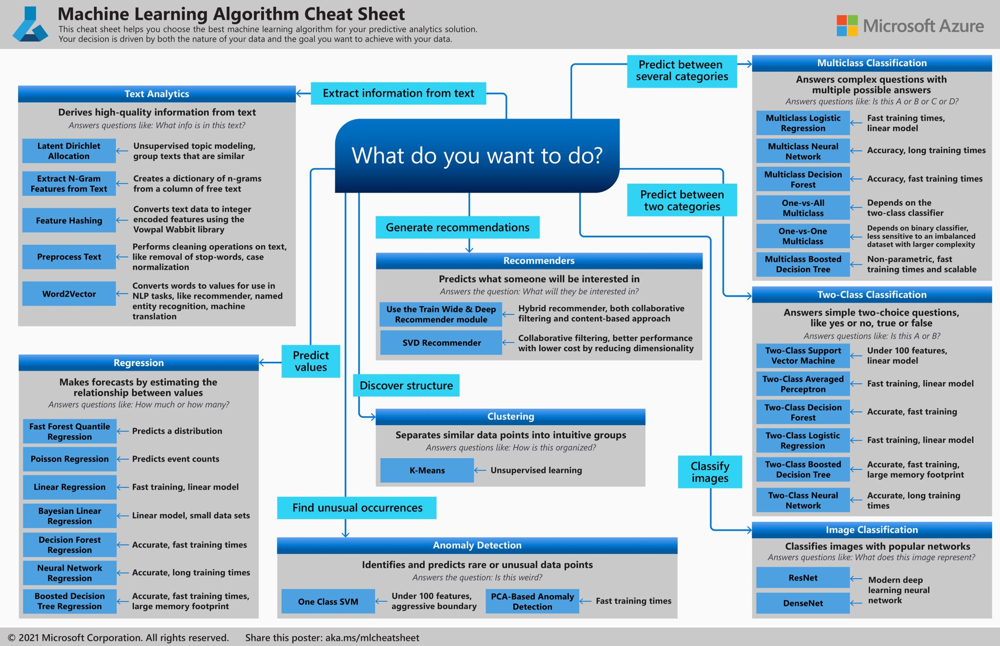
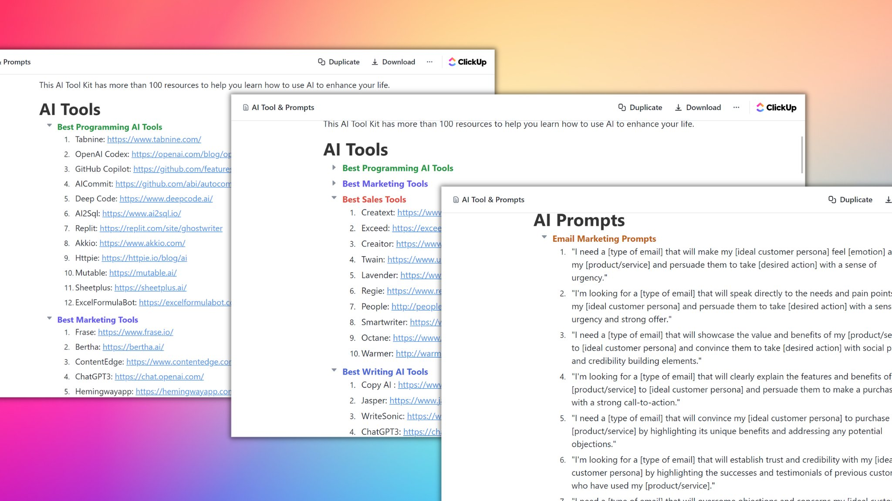

Developpeur resources
=====================

## Top 10 AI Tools Like ChatGPT You Must Try in 2023

00:07 - MidJourney AI Art
01:24 - Adobe Podcast AI Voice
02:18 - Nvidia Broadcast - AI Video Geforce
03:10 - Codedamn  - With ChatGPT Support
04:19 - Descript - AI Video
05:12 - Notion AI - AI Text Generation
06:26 - Synthesia - AI Avatar
07:00 - Resemble AI - Voice AI
07:39 - Soundraw AI - AI Music and Sound
08:13 - Futurepedia - AI Tools Database

## Filechat.io

Filechat is the perfect tool to explore documents using artificial intelligence. Simply upload your PDF and start asking questions to your personalized chatbot. Sign up for a free trial today, no credit card required.

### @HumataAI

lets you upload a .pdf up to 60 pages long & allows you to ask questions about it in plain English! 🔥

## https://typeset.io/

Your AI Copilot to decode any research paper
- The quickest way to read and understand scientific literature
- Highlight confusing text, math, and tables to get a simple explanation
- Ask follow-up questions and get instant answers
- A new way to search and find relevant papers without specifying keywords

### Study Azure for FREE

- Azure Introduction: https://bowtiedcyber.substack.com/p/introduction-to-microsoft-azure
- Azure Video Series: https://youtu.be/tDuruX7XSac
- Azure eBook: https://azure.microsoft.com/en-us/blog/free-ebook-the-developer-s-guide-to-microsoft-azure-now-available/
- Azure Practice Tests: https://examsnet.com/exams/microsoft-azure-certification-practice-online
- Azure Practice Labs: https://labs.azure.com
-  

### 8 AI tools to save you 100s of hours of manual work:

- Logos - @stockimgAI
- Translate - @PapercupAI
- Scrape data - @BrowseAI
- Change voice - @AlteredAi
- Storytelling - @magicaltome
- Edit videos - @playground_ai
- Book reader -  @elevenlabsio
- Real time ChatGPT - @ChatSonicAI

## 9 new red-hot AI tools you cannot miss:

Chat GPT - Research
Leiainc - Magical 3D
Grahamai - Tweet Writer
Fakeyou AI - Text to Speech
Simplified - Content Creator
Beautiful AI - Presentations
StoryLab - Hooks, Outlines
Designify - Automatic Designs
Flowcv - Job Winning Resume

### Practice Sites for Developers

➤ SQL
   - sqlzoo
   - sqlpad
   - schemaverse

➤ Programming
   - edabit
   - hackerrank
   - hackerearth

➤ DSA
   - leetcode
   - hackerrank
   - codechef
   - algoexpert
   - neetcode
   - projecteuler
   - codingame
   - pramp

### Learn web development for FREE using these resources ↓

1. HTML
http://w3schools.com/html

2. CSS
http://developer.mozilla.org

3. JavaScript
http://javascript.info

4. React.js
http://reactjs.org

5. Node.js
http://nodejs.dev

### Best tools you should be using in 2023:

1. http://writesonic.com/chat
ChatGPT with superpowers

2. http://grammarly.com
Correct mistakes, grammar

3. http://wordtune.com
Rewrite & enhance sentences.

4. http://canva.com
 Design tool

### AI Tolls

### Some design tools that have got your back ↓

1. Draw
http://draw.io

2. Figma
http://figma.com

3. Excalidraw
http://excalidraw.com

4. Canva
http://canva.com

5. Visme
http://visme.co

6. Sketch
http://sketch.com

### YouTube channels to learn Web Development 👇

CodeWithHarry
http://youtube.com/@CodeWithHarry

freeCodeCamp
http://youtube.com/@freeCodeCamp

JavaScript Mastery
http://youtube.com/@javascriptmastery

Traversy Media
http://youtube.com/@traversymedia

### Learn for free in 2023:

1. HTML
 https://html.com

2. CSS
https://css-tricks.com

3. JavaScript
https://javascript.info

3. Git & GitHub
https://git-scm.com

6. React
https://react-tutorial.app

7. APIs
https://rapidapi.com

8. SQL
https://sqlbolt.com

### 4 free AI powered resume builders:

1. http://Resumaker.ai
Auto-complete and fill data for you.

2. http://Kickresume.com
Build resume with ChatGPT.

3. http://Rezi.ai
Create resume with AI in minutes.

4. http://ResumAI.com
AI resume writing assistant. 

### This is a sneak peak into the future of medicine..

GlassAI launched an LLM-based tool capable of generating a diagnosis or clinical plan based on symptoms.

Also, ChatGPT recently passed the US Medical Licensing Exam.

Demo: http://glass.health/ai @GlassHealthHQ

### nanoGPT by @karpathy

The simplest, fastest repository for training/finetuning medium-sized GPTs.
Main language: Jupyter Notebook
https://github.com/karpathy/nanoGPT

### text-To-Video AND Image-To-Video
