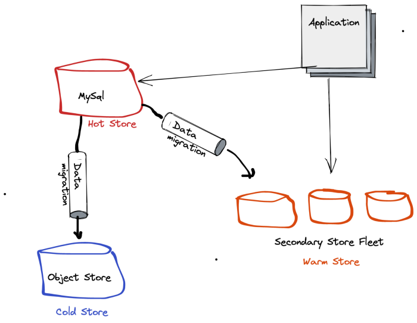
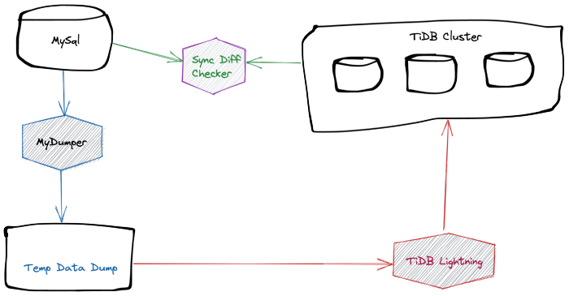
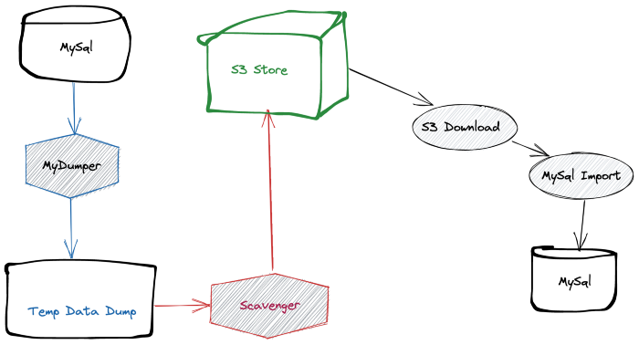
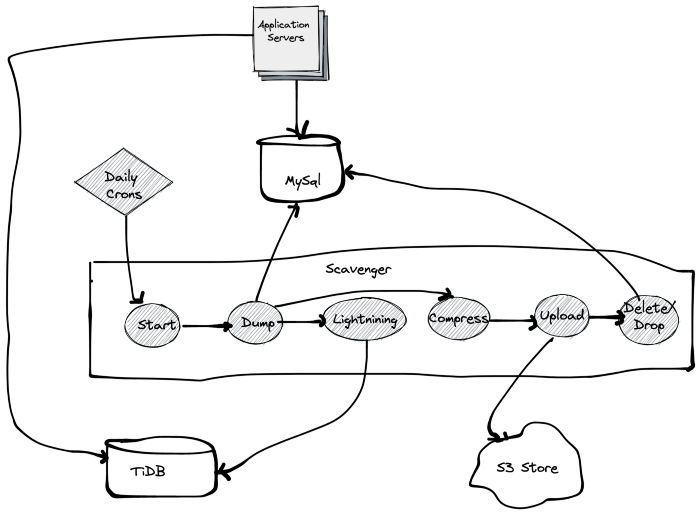

tiered-datastore-solution-for-high-data-growth-mysql-using-distributed-sql-databases-dsql
=========================================================================================

https://tech.flipkart.com/tiered-datastore-solution-for-high-data-growth-mysql-using-distributed-sql-databases-dsql-472e391deb7
https://docs.pingcap.com/

Quick summary about `DSQL`: To quote Wikipedia — “A distributed SQL database is a single relational database which replicates data across multiple servers. ...”

Now, there are multiple DSQL databases available, we chose Pingcap’s `TiDB`. Along with the excellent core DSQL features and being `MySQL` compatible, TiDB also provides a plethora of tooling.

Following are the tools provided by `TiDB`.

- `MyDumper`: Data Dumping tool to export data from MySQL
- `TiDB Lightning`: A lightning-fast tool to import the dump taken by the MyDumper to the TiDB cluster
- `TiDB Sync Diff Checker`: On-demand diff checker to make sure we do not miss out on any data.

## Cold Store - S3 Object Store:

For the cold store, since we don't need any sort of query ability, we can store all of our as dump files rather than maintaining any sort of relations. This will help us compress the data and save space as well.

## Continuous Archival

We made the entire process automated and continuous so that we have fewer manual touchpoints in our pipeline. We enhanced our archival tool (Scavenger) to have a data push step to both S3 and TiDB.

