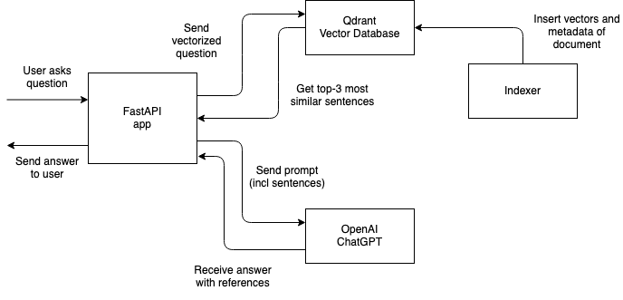

Build an AI Search Engine Using FastAPI, Qdrant, and ChatGPT
============================================================

github: https://github.com/dylanjcastillo/ai-search-fastapi-qdrant-chatgpt
url: https://dylancastillo.co/ai-search-engine-fastapi-qdrant-chatgpt/
date: MAR 3, 2023


In this tutorial, you'll learn how to use FastAPI, Qdrant, Sentence Transformers, and ChatGPT to create an AI search engine.

## Prerequisites

- [What semantic search is.](https://blog.dataiku.com/semantic-search-an-overlooked-nlp-superpower?ref=dylan-castillo)
- [What vector databases are.](https://www.pinecone.io/learn/vector-database/?ref=dylan-castillo)
- [What FastAPI is and how to use it.](https://fastapi.tiangolo.com/?ref=dylan-castillo)

## Designing a (Tiny) Search Engine with ChatGPT

1. `Extraction`: This part consists of extracting the data that you want users to be able to search. In this case, that means parsing [Meditations](https://en.wikisource.org/wiki/Marcus_Aurelius_Antoninus_-_His_Meditations_concerning_himselfe?ref=dylan-castillo). I won't go into detail about this because it is very project-specific. The [parsed data](https://github.com/dylanjcastillo/ai-search-fastapi-qdrant-chatgpt/blob/main/data/processed/Marcus_Aurelius_Antoninus_-_His_Meditations_concerning_himselfe/Marcus_Aurelius_Antoninus_-_His_Meditations_concerning_himselfe.json?ref=dylan-castillo) is available in the repository.
2. `Indexing`: This entails indexing the extracted data so that it can be accessed later when running searches. In this case, you'll use a semantic search approach, which means you'll search the data based on its meaning rather than keywords. That is, if you search for "How can I be happy?" you should get passages from Meditations that discuss happiness or feeling good, not just those that contain the exact words from the query.
3. `Search`: This consists of a backend service that processes the user's query, vectorizes it, finds vectors in the index that are the most similar to it, and then calls OpenAI's API to generate a summarized answer for the user.



## Set Up Your Local Environment

1. Install `Python 3.10`.
2. Install [Poetry](https://python-poetry.org/docs/?ref=dylan-castillo#installing-with-the-official-installer). It's not mandatory but I highly recommend it.
3. Clone the repository with the sample app:
	
	$ git clone https://github.com/dylanjcastillo/ai-search-fastapi-qdrant-chatgpt

4. Go to the root folder of the project and install the dependencies with:
	- `Poetry`: Create the virtual environment in the same directory as the project and install the dependencies:

	$ poetry config virtualenvs.in-project true
	$ poetry install

	- `venv and pip`: Create a virtual environment and install the dependencies listed in `requirements.txt`:

	$ python3.10 -m venv .venv && source .venv/bin/activate
	$ pip install -r requirements.txt	

> Because `PyTorch` does not yet support `Python 3.11 in MacOS and Windows`, this tutorial will not work if you are running `Python 3.11` on those operating systems.

a project structure that looks like this:

ai-search-fastapi-qdrant-gpt3
│
├── README.md
├── config.py
├── data
│   ├── processed
│   │   └── Marcus_Aurelius_Antoninus...
│   │       └── Marcus_Aurelius_Antoninus...json
│   └── unzipped
│       └── Marcus_Aurelius_Antoninus...
│           ├── index.html
│           ├── metadata.opf
│           └── style.css
├── main.py
├── notebooks
│   ├── extract_text.ipynb
│   └── vectorize_text.ipynb
├── poetry.lock
├── pyproject.toml
├── requirements.txt
├── .env-example
└── .venv/

- `config.py`: This file contains project configuration specifications such as Qdrant's host, port, and API key (read from a `.env` file)
- `data/`: This directory contains the project's data.
It contains Meditations as originally downloaded from [Wikisource](https://en.wikisource.org/wiki/Main_Page?ref=dylan-castillo) as well as the processed file that you will use in the project.
- `main.py`: This file contains the code of the FastAPI application.
- `notebooks/`: This directory contains Jupyter notebooks for extracting, vectorizing, and indexing the data. `extract_text.ipynb` contains code to parse the HTML file and `vectorize_text.ipynb` contains code to vectorize and index the data.
- `poetry.lock` and `pyproject.toml`: These files contain information about the project's dependencies and are used by Poetry to replicate the environment.
- `requirements.txt`: This file contains a list of Python packages required by the project and their respective versions.
- `.env-example`: This file is an example of the environment variables you must provide.
- `.venv/`: This directory contains the project's virtual environment.


## Configure Qdrant and OpenAI

Start by renaming `.env-example` to `.env`. 

## Qdrant

Create an account at [Qdrant](https://cloud.qdrant.io/accounts/ba9a5946-5367-4b2a-97a1-d12431c6a3e7/overview), if you don't already have one. Then, on your account page go to `Clusters` > `Create`, and create a cluster of `1GB of RAM`, `0.5 vCPU`, and `20GB Disk`.

Next, paste the host and API key you obtained when you created your cluster into `.env`:

```
QDRANT_PORT=6333
QDRANT_HOST=<your_qdrant_host>
QDRANT_API_KEY=<your_qdrant_api_key>
```

Finally, you can test that everything went well by running the first three cells in `vectorize_data.ipynb`.

## OpenAI

If you don't have an OpenAI account, create one. After that, go to `Manage account` > `API keys` >  + `Create new secret key`.

Then, paste the generated key in `.env`:

```
QDRANT_PORT=6333
QDRANT_HOST=<your_qdrant_host>
QDRANT_API_KEY=<your_qdrant_api_key>
OPENAI_API_KEY=<your_openai_api_key> # new
```

## Extract Data

The data extraction pipeline will vary greatly between projects, so I won't go into too much detail here.

Here are some useful guidelines to keep in mind when doing so:

1. `Garbage in`, `garbage out`: The quality of your data will heavily influence your search results, so take your time with this step.
2. `Splitting documents`: When you do semantic search, you need to divide documents into smaller chunks so that you can compare the similarity of each chunk to the user's query. There is no right or wrong way to do this. In this case, I took a straightforward approach: divide the text into paragraphs, and if the paragraph was too long for the vectorizer, divide it into multiple sentences.
3. `Production`: For real-world scenarios, you should think about how frequently you'll be extracting and ingesting data, adapting your pipeline for different data sources (e.g., scraping, APIs), and building pipeline monitors, among other things. In this example, because data extraction is a one-time event, I'm using jupyter notebooks, which isn't always a good idea.

Here's a sneak peek at the [data](https://github.com/dylanjcastillo/ai-search-fastapi-qdrant-chatgpt/blob/main/data/processed/Marcus_Aurelius_Antoninus_-_His_Meditations_concerning_himselfe/Marcus_Aurelius_Antoninus_-_His_Meditations_concerning_himselfe.json?ref=dylan-castillo) from this tutorial:


```json
{
    "book_title": "Meditations by Marcus Aurelius",
    "url": "https://en.wikisource.org/wiki/Marcus_Aurelius_Antoninus_-_His_Meditations_concerning_himselfe",
    "data": [
        {
            "title": "THE FIRST BOOK",
            "url": "https://en.wikisource.org/wiki/Marcus_Aurelius_Antoninus_-_His_Meditations_concerning_himselfe#THE_FIRST_BOOK",
            "sentences": [
                "I. Of my grandfather Verus I have learned to be gentle and meek...",
                "II. Of him that brought me up, not to be fondly addicted...",
                "III. Of Diognetus, not to busy myself about vain things...",
                "IV. To Rusticus I am beholding, that I first entered into the...",
            ]
 		}
 	]
}
```

The tutorial's data includes general metadata such as the book title and source URL, as well as information from each chapter with the sentences you'll index.

If you want to take a look at how I extracted the data used in this tutorial, check out the `extract_data.ipynb`.

## Vectorize and Index Data

Once you've extracted the data, you'll want to index it in your vector database.

The process consists of two steps:

1. Generate vectors for each sentence you extracted earlier.
2. Insert those vectors in a [collection](https://qdrant.tech/documentation/collections/?ref=dylan-castillo) (the set of vectors you can search in the vector database).
You can find the code for this section in `notebooks/vectorize_data.ipynb`.

As usual, you start by importing the required libraries:

```python
import json

import numpy as np
import pandas as pd
import torch

from qdrant_client import QdrantClient
from qdrant_client.http import models
from sentence_transformers import SentenceTransformer

from tqdm.notebook import tqdm

from config import QDRANT_HOST, QDRANT_PORT, QDRANT_API_KEY, DATA, COLLECTION_NAME
```

This code imports all the libraries and configuration variables you need to vectorize and index the data. Here are some things worth mentioning:

- `qdrant_client` and `qdrant_client.http` let you interact with Qdrant's client, so that you can insert and retrieve data from the collection.
- `sentence_transformers` let you generate the vectors from text, using pretrained models.

Next, you read the data as follows:

```python
BOOK_FILENAME = "Marcus_Aurelius_Antoninus_-_His_Meditations_concerning_himselfe"

with open(f"{DATA}/processed/{BOOK_FILENAME}/{BOOK_FILENAME}.json", "r") as file:
    meditations_json = json.load(file)

rows = []
for chapter in tqdm(meditations_json["data"]):
    for sentence in chapter["sentences"]:
        rows.append(
            (
                chapter["title"],
                chapter["url"],
                sentence,
            )
        )

df = pd.DataFrame(
    data=rows, columns=["title", "url", "sentence"]
)

df = df[df["sentence"].str.split().str.len() > 15]
```

This code reads the previously processed data and removes short sentences. It works as follows:

- Lines 1 to 4 read the JSON file you generated for Meditations, and save it as `meditations_json`.
- Lines 6 to 15 go through all the chapters of the book stored in the `data` key from meditations_json and for each chapter, it extracts the relevant data (title of chapter, URL of chapter, and sentence), and adds it to `rows`.
- Lines 17 to 21 create a DataFrame with the data from `rows` and removes the sentences with less than 15 words.

Next, you create a collection in your vector database:

```python
# Create collection
client = QdrantClient(
	host=QDRANT_HOST, port=QDRANT_PORT, api_key=QDRANT_API_KEY
)
client.recreate_collection(
    collection_name=COLLECTION_NAME,
    vectors_config=models.VectorParams(
    	size=384, 
    	distance=models.Distance.COSINE
    ),
)
```

This code connects to your Qdrant's cluster and creates a collection based on the name and settings you provide. In this case, you set the `size` to 384 based on the needs of the [model](https://huggingface.co/sentence-transformers/msmarco-MiniLM-L-6-v3?ref=dylan-castillo) you'll use for vectorizing the sentences. You also set `distance` to use [Cosine distance](https://en.wikipedia.org/wiki/Cosine_similarity?ref=dylan-castillo), which will define how the similarity between vectors is computed.

The next step is to generate the vectors (embeddings) from the text. You'll use a pretrained model from Sentence Transformers to generate them instead of OpenAI-based embeddings. [The latter are more expensive and not necessarily better](https://medium.com/@nils_reimers/openai-gpt-3-text-embeddings-really-a-new-state-of-the-art-in-dense-text-embeddings-6571fe3ec9d9).

To accomplish this, you load the pretrained model, generate the embeddings from the DataFrame sentences, and insert them into the collection you created:

```python
model = SentenceTransformer(
    "msmarco-MiniLM-L-6-v3",
    device="cuda"
    if torch.cuda.is_available()
    else "mps"
    if torch.backends.mps.is_available()
    else "cpu",
)

vectors = []
batch_size = 512
batch = []

for doc in tqdm(df["sentence"].to_list()):
    batch.append(doc)
    
    if len(batch) >= batch_size:
        vectors.append(model.encode(batch))
        batch = []

if len(batch) > 0:
    vectors.append(model.encode(batch))
    batch = []
    
vectors = np.concatenate(vectors)

book_name = meditations_json["book_title"]

client.upsert(
    collection_name=COLLECTION_NAME,
    points=models.Batch(
        ids=[i for i in range(df.shape[0])],
        payloads=[
            {
                "text": row["sentence"],
                "title": row["title"] + f", {book_name}",
                "url": row["url"],
            }
            for _, row in df.iterrows()
        ],
        vectors=[v.tolist() for v in vectors],
    ),
)
```

This code loads the model, generates vectors from the sentences in the DataFrame, and inserts them into the collection you created. Here's how it works:

- Lines 1 to 8 load the `msmarco-MiniLM-L-6-v3` sentence transformer model, and set the correct device in case you have a GPU available.
- Lines 10 to 23 generate an array of vectors using the model you loaded. Each vector is a numerical representation of the sentences from your DataFrame.
- Lines 29 to 43 insert the vectors and the additional data (actual sentence, book and chapter title, and URL) into the collection in your vector database.

## Create a Server with FastAPI

Next, you will create the FastAPI application that will let the user interact with your vector database and ChatGPT. The code for this section is in `main.py`.

You start by importing the required dependencies, setting up your Qdrant client, and loading the model:

```python
import openai
from fastapi import FastAPI
from qdrant_client import QdrantClient
from sentence_transformers import SentenceTransformer

from config import (
    COLLECTION_NAME,
    OPENAI_API_KEY,
    QDRANT_API_KEY,
    QDRANT_HOST,
    QDRANT_PORT,
)

openai.api_key = OPENAI_API_KEY

qdrant_client = QdrantClient(
    host=QDRANT_HOST,
    port=QDRANT_PORT,
    api_key=QDRANT_API_KEY,
)

retrieval_model = SentenceTransformer("msmarco-MiniLM-L-6-v3")

app = FastAPI()
```

This code imports the libraries and configuration settings, initializes the Qdrant client, and loads the model to memory (the same one you used for vectorizing the sentences). You load your model globally so that you don't slow down requests by loading it each time someone asks a question.

Next, you define a function to help you create the prompt that you'll use to get ChatGPT to generate a coherent answer based on the most relevant passages from Meditations:

```python
def build_prompt(question: str, references: list) -> tuple[str, str]:
    prompt = f"""
    You're Marcus Aurelius, emperor of Rome. You're giving advice to a friend who has asked you the following question: '{question}'

    You've selected the most relevant passages from your writings to use as source for your answer. Cite them in your answer.

    References:
    """.strip()

    references_text = ""

    for i, reference in enumerate(references, start=1):
        text = reference.payload["text"].strip()
        references_text += f"\n[{i}]: {text}"

    prompt += (
        references_text
        + "\nHow to cite a reference: This is a citation [1]. This one too [3]. And this is sentence with many citations [2][3].\nAnswer:"
    )
    return prompt, references_text
```

This code will combine a prompt to make ChatGPT "simulate" Marcus Aurelius answering a user-supplied question with a list of references previously obtained from your vector database. Then it will return the generated prompt, and a list of the references to add to the answer sent to the user.

Then you create two endpoints as follows:

```python
@app.get("/")
def read_root():
    return {
        "message": "Make a post request to /ask to ask a question about Meditations by Marcus Aurelius"
    }


@app.post("/ask")
def ask(question: str):
    similar_docs = qdrant_client.search(
        collection_name=COLLECTION_NAME,
        query_vector=retrieval_model.encode(question),
        limit=3,
        append_payload=True,
    )

    prompt, references = build_prompt(question, similar_docs)

    response = openai.ChatCompletion.create(
        model="gpt-3.5-turbo",
        messages=[
            {"role": "user", "content": prompt},
        ],
        max_tokens=250,
        temperature=0.2,
    )

    return {
        "response": response["choices"][0]["text"],
        "references": references,
    }
```

These are the two endpoints that you'll use in your app. Here's what each line does:

- Lines 1 to 5 set up an endpoint that accepts `GET` requests on "/". It returns a JSON response with a `message` key telling the user to use the "/ask" endpoint.
- Lines 8 to 17 define an endpoint that takes accepts `POST` requests on "/ask", with a single parameter, `question` of `string` type. Once the user submits a request, you vectorize the question using the model you loaded previously, then you get the 3 most similar documents from your vector database.
- Lines 19 to 32 combine the documents you got from the vector database with your prompt and make a request to the ChatGPT API. You set `max_tokens=250` to keep answers short and set `temperature=0.2`, to prevent the model from getting "too creative" with its responses. Finally, you extract the answer from the ChatGPT API response and return it to the user, along with the references.

If you want to test it locally, type the following command into a terminal (inside the project's virtual environment):

	$ uvicorn main:app --reload

In your browser, navigate to `localhost:8000/docs` to test your `/ask` endpoint:

Question: "How can I be a better person ?"

## Deploy Your App

There are many different ways to deploy an app, so you choose whatever approach you prefer. In my case, I like to use a VPS with NGINX acting as a reverse proxy and using Gunicorn as a process manager with Uvicorn workers. If you'd like to follow that approach, check a [tutorial](https://dylancastillo.co/fastapi-nginx-gunicorn/) I wrote about it.

If you choose that route, keep the following points in mind:

- You should use `--preload` if you want to share the same model across all the processes and use less RAM memory.
- There are memory leak issues when serving some types of [models](https://github.com/tiangolo/fastapi/issues/2425?ref=dylan-castillo). A workaround that has worked for me is setting `--max-requests` and `--max-requests-jitter` to low numbers.

## Conclusion

Way to go! In this tutorial, you've built a (tiny) AI search engine. You've learned:

- How to structure the project.
- How to set up a vector database using Qdrant.
- How to vectorize your data using Sentence Transformers.
- How to use ChatGPT to combine references into a coherent answer.

Hope you found this tutorial useful. Let me know if you have any questions!

All the code for this tutorial is [available on GitHub](https://github.com/dylanjcastillo/ai-search-fastapi-qdrant-chatgpt).