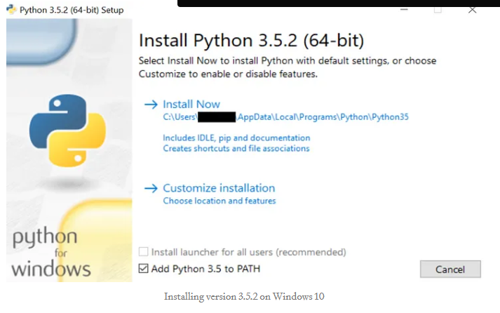

Work with multiple python versions on Windows 10
================================================

## Install multiple python versions

## Using the python launcher (py)

	$ py --list

## Setup a virtual environment with a specific python version

In order to create a new environment (in this case named venv) which uses a specific python version, e.g. 3.7 do

	$ py -3.7 -m vent env

The next step in configuring a virtual environment is to actually activate it.

	$ env\Scripts\activate

	$ python --version