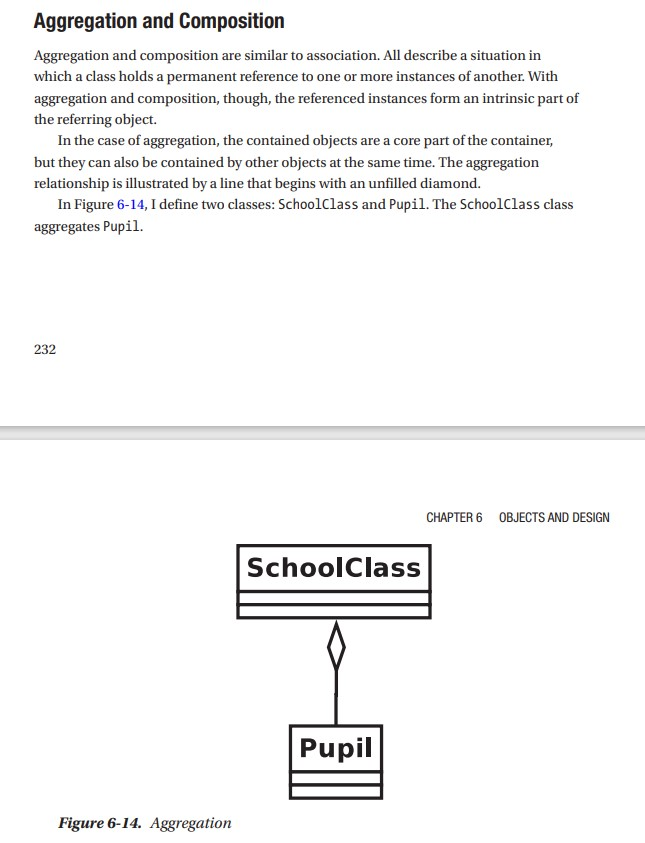
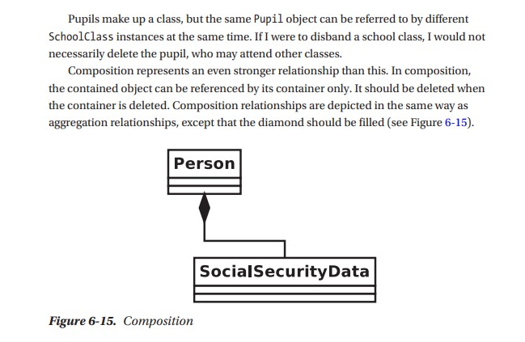
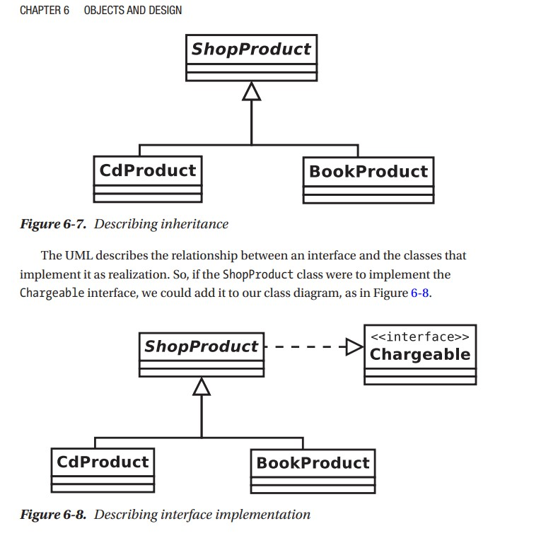
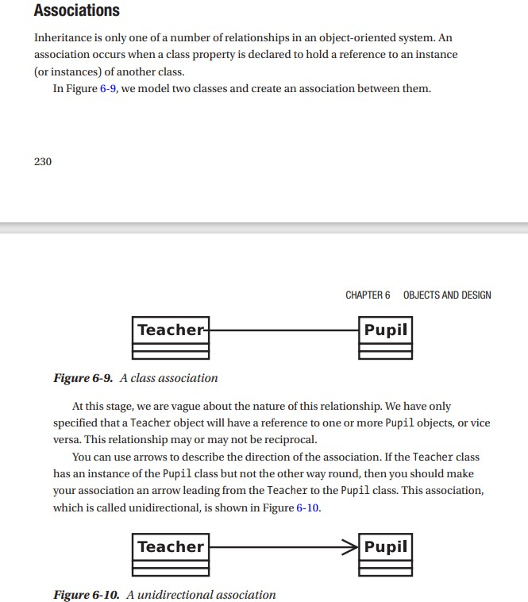

UMl Roadmap
===========

## Notions

- Class
- Association

## Free UML onLine Tools

- https://app.diagrams.net

## Resources

- https://www.tutorialspoint.com/uml/uml_basic_notations.htm

## UML Basic Notations

### aggregate

### composition

### inheritance

### association

## UML Class Diagram

- https://www.uml-diagrams.org/class-diagrams-overview.html

## UML Sequence Diagram

- https://www.uml-diagrams.org/sequence-diagrams-overview.html
- https://www.uml-diagrams.org/sequence-diagrams-example.html

## UML Use Case Diagram

- https://www.uml-diagrams.org/use-case-diagrams-overview.html

## UML Activity Diagram

- https://www.uml-diagrams.org/activity-diagrams-overview.html

## UML State Machine Diagram

- https://www.uml-diagrams.org/state-machine-diagrams-overview.html

## UML Deployment Diagram

- https://www.uml-diagrams.org/deployment-diagrams-overview.html

## UML Component Diagram

- https://www.uml-diagrams.org/component-diagrams-overview.html

## UML Composite Structure Diagram

- https://www.uml-diagrams.org/composite-structure-diagrams-overview.html

## UML Timing Diagram

- https://www.uml-diagrams.org/timing-diagrams-overview.html

## UML Interaction Overview Diagram

- https://www.uml-diagrams.org/interaction-overview-diagrams-overview.html

## UML Communication Diagram

- https://www.uml-diagrams.org/communication-diagrams-overview.html

## UML Object Diagram

- https://www.uml-diagrams.org/object-diagrams-overview.html

## UML Package Diagram

- https://www.uml-diagrams.org/package-diagrams-overview.html

## UML Profile Diagram

- https://www.uml-diagrams.org/profile-diagrams-overview.html

## UML Constraint Diagram

- https://www.uml-diagrams.org/constraint-diagrams-overview.html

## UML Interaction Constraint Diagram

- https://www.uml-diagrams.org/interaction-constraint-diagrams-overview.html

## UML Activity Partition Diagram

- https://www.uml-diagrams.org/activity-partition-diagrams-overview.html

## UML Interaction Use Case Diagram

- https://www.uml-diagrams.org/interaction-use-case-diagrams-overview.html
