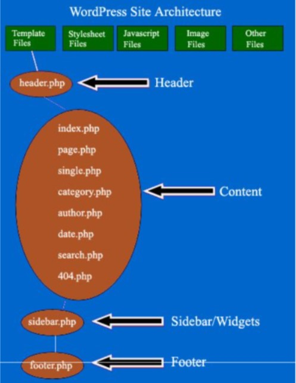

WordPress Architecture Explained in Great
=========================================

Last Updated: May 20, 2022

1. Understanding WordPress architecture 
2. Understanding the functionality of the most common template files used in WordPress 
3. Template files call other template files
4. Understanding the functionality of WordPress installation files and folders admin panel
5. Introduction to phpMyAdmin
7. WordPress permalinks
8. Changing your WordPress log-in username WordPress website
9. Creating custom page templates 
10. Common WordPress issues
11. Issue #1: How to fix ‘Error establishing a database connection’ in WordPress
12. Issue #2: How to fix the error: “It looks like this is a web page. nota feed 
13. Issue #3: RSS feed is showing only one item
14. Issue #4: WordPress plugin doesn’t work and you can't remove it through admin panel
15. Issue #5: You can't fix the issue with your current WordPress theme & can't remove it via your admin panel
16. Issue #6: Optimizing the speed of youy WordPress site
17. Issue #7: Optimizing pages of your WordPress website for SEO
18. Issue #8: Removing malware from your WordPress site
19. Issue #9: Categories not working in WordPress
20. Recommended WordPress Plugins
21. Other articles on WordPress
22. Frequently asked questions about WordPress website architecture

WordPress is the most popular CMS in the world. Therefore it is imperative that you understand how this CMS works, how it can be customized and how it can be debugged.

Such knowledge can help you greatly in optimizing a WordPress website for conversions, adding tracking code and search engine optimization (SEO).

## Understanding WordPress architecture

Half of the WordPress optimization battle is won if we know what we are doing in the first place and
understand its consequences. Therefore it is imperative to understand how a WordPress website works and is structured.

Without this knowledge, you will have a hard time troubleshooting any WordPress issue.

 

Every WordPress installation comes with a default theme. You can either use this theme or you can use a custom theme. In either case,

A WordPress theme is made up of template files, style sheet files, JavaScript files, Image files and some other files like functions.php.

All these files work together to create the design and functionality of your WordPress website.

All the WordPress themes files live in the folder: /wp-content/themes/. For example, all the files associated with the theme named ‘**mystique**’ would by default reside in the folder: /wp-content/themes/mystique/

**Template files are PHP files (.php) that are used to generate web pages and which makes customization possible in WordPress.**

The more template files your theme has got, the more customization you can do.

Some template files are used on all the web pages (like header and footer template files), while others are used only under specific conditions.

>WordPress decides which template files to load when, according to the template hierarchy rules,

**Note**: The actual name of a template file can vary depending upon the theme you are using.

## Understanding the functionality of the most common template files used in WordPress

 

Following are some of the most commonly used WordPress template files, which you must be aware of:

### header.php
    1. This file display headers and navigation.
    2. If you want to make changes to the head section(&lt;head&gt;...&lt;/head&gt; of each web page (like adding the Google Analytics Tracking Code or other tracking code etc) then you need to edit this file.
    3. You can edit the file by going to your WordPress Admin Panel > Appearance > Editor > header.php

### index.php
    1. This template file is used to display the **blog post index**.
    2. The blog post index contains a loop (a bunch of PHP code) that displays the most recent blog posts according to some predefined conditions. It displays a list of posts in excerpt or full-length form.
    3. The blog post index can be set to display on the front page of your website or on a separate static page.
    4. You can edit this file via your WordPress admin panel > Appearance > Editor > index.php or Settings > Reading.

### home.php
    1. This template file can also be used to display the blog post index.
    2. The blog post index can be set to display on the front page of your website or on a separate static page.
    3. If this file is missing then WordPress looks for a file called index.php in the active theme's directory & uses that template to display the blog post index.
    4. You can edit the file by going to your WordPress Admin Panel > Appearance > Editor > home.php

### front-page.php
    1. This template file displays your website's front page (which is usually called the home page). The front page can be a static page or a blog posts index.
    2. WordPress searches for this file first when you load the front page of your WordPress website. If this file is missing then WordPress looks for a file called home.php. If home.php is also missing then WordPress looks for a file called index.php and uses that template to display the front page of your website.
    3. You can edit the file by going to your WordPress Admin Panel > Appearance > Editor > front-page.php

### page.php
    1. This template file displays the page title and its contents.
    2. If you are a logged-in user with ‘edit’ permission then this file displays the ‘Edit’ link through which you can edit the contents of a page.
    3. It also displays comment list and comment form.
    4. You can edit the file by going to your WordPress Admin Panel > Appearance > Editor > page.php

### single.php

The template file displays:
    1. blog post's title
    2. blog post's content
    3. author’s name
    4. date of the post
    5. post category & tags
    6. comment list
    7. comment form
    8. Navigation links to the previous and next posts.
    9. If you are a logged-in user with ‘edit’ permission then this file displays the ‘Edit’ link through which you can edit the contents of your blog post.
    10. You can edit the file by going to your WordPress Admin Panel > Appearance > Editor > single.php

### category.php

This template file controls how category pages should be displayed. You can edit the file by going to your WordPress Admin Panel > Appearance > Editor > category.php

### author.php

This template file controls how an author page should be displayed. You can edit the file by going to your WordPress Admin Panel > Appearance > Editor > author.php

### search.php
    1. This template file controls how a search result page should be displayed.
    2. It can display a list of posts in excerpt or full-length form.
    3. Edit this file if you want to customize your search result page.
    4. You can edit the file by going to your WordPress Admin Panel > Appearance > Editor > search.php

### 404.php
    1. This template file is used when WordPress cannot find the post or page which is queried.
    2. Edit this file if you want to customize your 404 page.
    3. You can edit the file by going to your WordPress Admin Panel > Appearance > Editor > 404.php

### footer.php

Edit this file to change the footer of each web page on your site. Many times we need to add tracking code or some javascript just before the &lt;/body&gt; tag or edit footer links. Use this file for such a purpose. You can edit the file by going to your WordPress Admin Panel > Appearance > Editor > footer.php

### comments.php

This template file decides how the comments should be displayed. It also displays trackbacks, pingbacks and Gravatars. You can edit the file by going to your WordPress Admin Panel > Appearance > Editor > comments.php

### style.css
    1. This is the main style sheet file of your WordPress theme and is used to control the design and layout of your web pages.
    2. You can also edit this file to change the theme name, author name or author URL.
    3. You can edit the file by going to your WordPress Admin Panel > Appearance > Editor > style.css

### sidebar.php
    1. This template file is used to control the sidebar display.
    2. You can set up the contents of the sidebar widgets through the WordPress admin panel.
    3. You can edit the file by going to your WordPress Admin Panel > Appearance > Editor > sidebar.php

### functions.php
    1. This file is used to add your own custom features to your theme. It works like a plug-in file.
    2. Since this file is theme-specific, you lose the custom functionality once you change your theme.
    3. Not all WordPress themes use this file.
    4. If this file doesn’t come with your theme, then you can create it under the wp-content/themes/yourThemeFolder and add PHP functions to it.
    5. You can edit the file by going to your WordPress Admin Panel > Appearance > Editor > functions.php

>Note: Before you edit any template file, take a backup of it. So if something goes wrong, you can always

## Template files call other template files

In WordPress, it is quite common for a template file to reuse the code/functionality of other template files.

This is done by calling/loading a template file into another template file.

For example, the template file ‘single.php’ can call another template file say ‘post-single.php’ by using the following line of code:

>get_template_part(‘post’, ‘single’);

So if the template file ‘post-single.php’ is actually controlling the blog post contents then you need to edit this file instead of ‘single.php’.

>Note: Template files’ names and how they are loaded can vary from one WordPress theme to another.

It can sometimes be difficult to determine the exact template file being used to display a particular web page element.

Here you can use the ‘Reveal Template’ plugin which displays the template being used at the footer of your website (only to admin by default):

## Understanding the functionality of WordPress installation files and folders

These are the files that are unique to a particular WordPress installation and contain all of your website data.

So if you want to take a backup of your WordPress website then take a backup of the following installation files and folders.

### /wp-content/

This folder contains all of your plug-ins and themes. It also contains all of your blog posts and comments (in the ‘cache’ sub-folder). So if you want to take a backup of your WordPress site then first take a backup of this folder.

### /wp-config.php

This file stores your WordPress database information like database name, database username, database password, etc. It is a very important file and can easily take down your website. So don’t mess with it unless you know what you are doing.

### .htaccess

Another important file for server access control. You can find this file in the root folder via your FTP. It is a very important file and can easily take down your website. So don’t mess with it unless you know what you are doing.

### favicon.ico

This is your website's favicon file. You can find this file in the root folder via your FTP.

### robots.txt

This file is used to block specified files and folders from being crawled and indexed by Google.

## Take regular backups of your WordPress database

Your WordPress database stores all of your blog posts, website pages, comments, categories, tags and other website specific contents.

In order to truly take a backup of your WordPress website, you need to take a backup of your WordPress My SQL database.

You can take a backup of your database manually through phpMyAdmin or you can use a plugin like **WP-DBManager** which not only can take a backup of your database but can also repair and restore the database.

## WordPress permalinks

Permalinks are simply the URLs of the pages, post and category pages on your WordPress website.

By changing the structure of permalinks you can change the structure of your website URLs.

By default, WordPress URLs have got question marks and numbers in them (default permalink structure) which makes it difficult to understand what a web page is all about.

Here is what the default permalink structure looks like:

 

To change permalinks settings, follow the steps below:

Step-1: login to your WordPress admin area
Step-2: go to the Settings menu > Permalinks
Step-3: Select the ‘Post Name’ permalink structure to make your blog post URLs descriptive and readable:

 

It is a best practice to change the permalink structure immediately after a fresh WordPress installation.

If you have been running your website for the last couple of months or years then you should first 301 redirect (using .htaccess) all of the old URLs to new URLs before you change your permalink structure, otherwise, you may end up losing a significant amount of traffic from search engines.

## Changing your WordPress log-in username

By default, WordPress doesn’t let you change the log-in username.

If you go to the dashboard and click on ‘Users’ > ‘Your Profile’ you will see the following text next to the username field: Usernames cannot be changed:

 

To change your WordPress username, follow the steps below:
Step-1: Login to PHPMyAdmin
Step-2: Locate and select the **wp_users** table (Note: the wp prefix may differ) and then click the browse icon.
Step-3: Click on the pencil icon next to the ‘**user_login**’ column.
Step-4: Change the log-in name to your preferred name and then click on the ‘Go’ button.
Step-5: Now log in to your dashboard with the new username and password.

## Creating custom page templates

In WordPress, you can create and apply your own template to the pages if you are not satisfied with existing templates.

Say you want to create pages that have got no sidebar and at the same time, it doesn’t have full width. You may also want this template to be available from the ‘Template’ drop-down menu under the ‘Page Attributes’ section:

 

To create such a custom page template, follow the steps below:
Step-1: Login to your WordPress admin panel and then go to Appearance > Editor
Step-2: Find and open the ‘page.php’ file.
Step-3: Copy-paste the code of this file into notepad and save the file with a new file name say ‘nosidebar.php’
Step-4: Now modify the ‘nosidebar.php file as follows:

```php
#4.1 Find and remove the following line of code:
<?php get_sidebars(); ?>

This code displays the sidebar on your website.

#4.2 Add following code at the very top of the file:

<?php
//
* Template Name: No Sidebar, No full width
* Description: Page template without sidebar
//

```


This code tells WordPress, that the new file is a custom page template.

Step-5: Save the modified ‘nosidebar.php’ file and upload it to your ‘themes’ directory via PHP.

The new custom page template would now be available from the ‘Template’ drop-down menu under the

 

## Common WordPress issues

### Issue #1: How to fix ‘Error establishing a database connection’ in WordPress

This error occurs when you change your database password but do not update your wp-config.php file or vice versa.

**Solution**: If you change your database password then you also need to update your wp-config.php file (which is located in the root directory /htm! in FTP file manager).

If you don’t update your wp-config.php file then you will get the error message ‘error establishing a
database connection’

Open your ‘wp-config.php’ file via FTP and locate the section that looks like this example:

```php
/* The name of the database for WordPress */
define(‘DB_NAME’, ‘putyourdbnamehere’);
/* MySQL database username */
deFineC‘DR_USFR?, ‘usernamehere’);
/* MySQL database password */
define(‘pB_PASSwoRD', ‘yourpasswordhere'); <-Update your database password here
/* MySQL hostname */
define(‘p8_HosT’, ‘locaThost’);
```

### Issue #2: How to fix the error: “It looks like this is a web page, not a feed”

I have got this error several times.

This error usually occurs when permalinks stop working properly.

**Solution**: To make the permalinks work again: Go to your WordPress admin panel &gt; Settings &gt; Permalinks &gt; click on the ‘save changes’ button.

### Issue #3: RSS feed is showing only one item

**Solution** — Make sure that the feed URL (like https:/Awww.optimizesmart.com/feed/) is correct.

If the feed URL is correct but still your feed is showing only one item, then make sure that your feed is a valid feed via **feedvalidator.com**

### Issue #4: WordPress plugin doesn’t work and you can’t remove it through admin panel

**Solution**— You need to remove the WordPress plug-in via your FTP. Follow the steps below:

1. Access the FTP of your website.
2. Locate the folder ‘wp-content’.
3. Look for the folder ‘plugins’ and then open it.
4. Select the plugin folder you want to delete and then right-click on it.
5. Choose ‘delete’ from the drop-down menu.

### Issue #5: You can’t fix the issue with your current WordPress theme & can’t remove it via your admin panel

**Solution**— You need to remove the WordPress theme via your FTP. Follow the steps below:

1. Access the FTP of your website.
2. Locate the folder ‘wp-content’
3. Look for the folder ‘themes’ and then open it.
4. Select the theme folder you want to delete and then right-click on it.
5. Choose ‘delete’ from the drop-down menu.

### Issue #6: Optimizing the speed of your WordPress site

**Solution**: There are lots of things you can do to optimize the speed of your WordPress site. But it can be really time-consuming.

So if you are short of time and you just want a switch that can dramatically improve the speed of your website then install the **W3 Total Cache Plugin**.

It is one of the highest-rated and most useful WordPress plug-ins ever developed. It can dramatically improve your website speed.

### Issue #7: Optimizing pages of your WordPress website for SEO

**Solution**: I have used several plug-ins for this purpose but the one which stands out all the time is the **Yoast WordPress SEO Plugin**.

This all-in-one SEO plug-in gives you control over title tags, meta tags, canonical, 404 errors, rich snippets and tons of other WordPress features. I use this plugin for my website.

### Issue #8: Removing malware from your WordPress website

**Solution**: This is one of the most common and serious issues we WordPress users face. Here is what I do to keep my website malware free:

1. Use **code guard**. This tool keeps track of all the changes made to your website. If this tool notice that the change in code (like changes to the .htaccess file) can harm the normal functioning of your website, then it sends you an alert. It takes hourly, daily and monthly backup of your website.
2. Always keep your WordPress version, plugins and theme up to date. Upgrade to the latest version. Every new version comes with a security patch and makes your website more secure.
3. Take weekly back up of your website.
4. Be cautious while installing a plug-in or a theme. Sometimes plug-ins/themes contain malicious code which can harm your website.
5. Scan all your documents/software for malware before you make them available for download.
6. Only link out to reputed websites as some websites host malware.
7. Use only reputable advertisers as they are generally malware-free.
8. Monitor user-generated areas of your website like the comments section. Unmoderated comments can have links to malicious websites/files.

>To learn more about removing malware from your WordPress website, check out this post:
>Malware Removal Checklist for WordPress — DIY Security Guide

### Issue #9: Categories not working in WordPress

You have to set up a custom permalink structure for the category. Follow the steps below:
Step-1: Login to the WordPress admin panel.
Step-2: Click on the ‘permalinks’ under the ‘settings’ section.
Step-3: Enter ‘category’ in the ‘category base’ field:

 

## Recommended WordPress Plugins

One of the biggest advantages of using WordPress is the ability to choose and install plugins that can greatly enhance the functionality of your website without any coding.

I am not a big fan of plug-ins because they tend to slow down a website. But there are some plug-ins that are so useful that I can’t think of running a site without them.

Following is a list of must-have plug-ins:

1. Akismet — It protects your blog from comment and trackback spam. Without this plugin, you will be bombarded with spam sooner than later.
2. Crayon Syntax Highlighter - this plugin makes it possible to share code (JavaScript code, PHP code, etc) on a web page (without any loss of formatting). It highlights the code syntax in such a way that it becomes easy to read and understand the shared code.
3. Gravity Forms - this is a paid plugin through which you can embed forms on your website and collect leads.
4. Yoast SEO — best plugin to easily optimize your WordPress website pages for SEO.

## Other articles on WordPress

- WordPress Website Speed Optimization
- Malware Removal Checklist for WordPress — DIY Security Guide
- Google Tag Manager WordPress Installation Guide
- Two Plugins that will make your WordPress website GDPR Compliant pretty fast
- The Two New GDPR Compliance Tools in WordPress

## Frequently asked questions about WordPress website architecture

### What is a WordPress theme?

A WordPress theme is made up of template files, style sheet files, JavaScript files, image files
and some other files like functions.php.

All these files work together to create the design and functionality of your WordPress website.

All the WordPress theme files live in the folder: /wp-content/themes/. For example, all the files
associated with the theme named ‘mystique’ would by default reside in the folder: /wp-content/themes/mystique/

### What are WordPress template files?

Template files are PHP files (.php) which are used to generate web pages and which makes customization possible in WordPress.

The more template files your theme has got, the more customization you can do.
